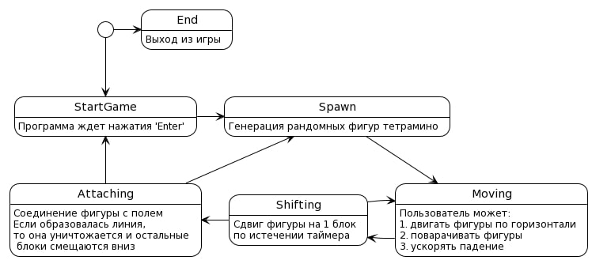
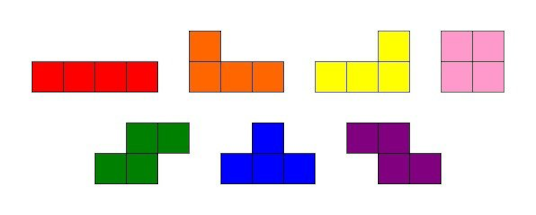
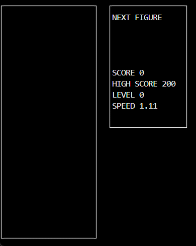

# BrickGame Тетрис
Реализация игры «Тетрис» на языке программирования С с использованием структурного подхода.

### Конечный автомат

«Тетрис», наверное, одна из самых популярных игр для консоли Brickgame. Нередко и саму консоль называют тетрисом. Цель игры — в наборе очков за построение линий из генерируемых игрой блоков. Очередной блок, сгенерированный игрой, начинает опускаться вниз по игровому полю, пока не достигнет нижней границы или не столкнется с другим блоком. Пользовать может поворачивать фигуры и перемещать их по горизонтали, стараясь составлять ряды. После заполнения ряд уничтожается, игрок получает очки, а блоки, находящиеся выше заполненного ряда опускаются вниз. Игра заканчивается, когда очередная фигура останавливается в самом верхнем ряду.

Для формализации логики данной игры можно представить следующий вариант конечного автомата:

Данный КА состоит из следующих состояний:

- Старт — состояние, в котором игра ждет, пока игрок нажмет кнопку готовности к игре.
- Спавн — состояние, в которое переходит игра при создании очередного блока и выбора следующего блока для спавна.
- Перемещение — основное игровое состояние с обработкой ввода от пользователя — поворот блоков/перемещение блоков по горизонтали.
- Сдвиг — состояние, в которое переходит игра после истечения таймера. В нем текущий блок перемещается вниз на один уровень.
- Соединение — состояние, в которое преходит игра после «соприкосновения» текущего блока с уже упавшими или с землей. Если образуются заполненные линии, то она уничтожается и остальные блоки смещаются вниз. Если блок остановился в самом верхнем ряду, то игра переходит в состояние «игра окончена».
- Игра окончена — игра окончена.

### Информация

- Программа разработана на языке Си стандарта C11 с использованием компилятора gcc.
- Программа состоит из двух частей: библиотеки, реализующей логику игры тетрис, и терминального интерфейса с использованием библиотеки `ncurses`.
- Для формализации логики игры использован конечный автомат.
- Библиотека имеет функцию, принимающая на вход ввод пользователя, и функцию, выдающую матрицу, которая описывает текущее состояние игрового поля, при каждом ее изменении.
- Код библиотеки программы находится в папке `src/brick_game/tetris`.
- Код с интерфейсом программы находится в папке `src/gui/cli`.
- Сборка программы настроена с помощью Makefile со стандартным набором целей для GNU-программ: all, install, uninstall, clean, dvi, dist, test, gcov_report. Установка ведется в каталог build.
- Программа разработана в соответствии с принципами структурного программирования.

### Управление и игровое поле

- В игре присутствовуют следующие механики:
  - Вращение фигур;
  - Перемещение фигуры по горизонтали;
  - Ускорение падения фигуры (при нажатии кнопки фигура перемещается до конца вниз);
  - Показ следующей фигуры;
  - Уничтожение заполненных линий;
  - Завершение игры при достижении верхней границы игрового поля;
  - В игре присутствовуют все виды фигур, показанных на картинке ниже.
- Для управления имеется поддержка всех кнопок, предусмотренных на физической консоли:
  - Начало игры - 'ENTER',
  - Пауза - 'P',
  - Завершение игры - 'ESC',
  - Стрелка влево — движение фигуры влево,
  - Стрелка вправо — движение фигуры вправо,
  - Стрелка вниз — падение фигуры,
  - Стрелка вверх — ни используется в данной игре,
  - Действие (вращение фигуры) - 'Z'.
- Игровое поле соответствовует размерам игрового поля консоли — десять «пикселей» в ширину и двадцать «пикселей» в высоту.
- Фигура, после достижения нижней границы поля или соприкосновения с другой фигурой остановливается. После этого происходит генерация следующей фигуры, показанной на превью.
- Пользовательский интерфейс поддерживает отрисовку игрового поля и дополнительной информации.

Используемые фигуры:

### Уровни

В игре реализованы следующие механики:

- подсчет очков;
- хранение максимального количества очков.

Данная информация передается и выводится пользовательским интерфейсом в боковой панели. Максимальное количество очков хранится в файле и сохраняется между запусками программы.

Максимальное количество очков изменяется во время игры, если пользователь во время игры превышает текущий показатель максимального количества набранных очков.

Начисление очков будет происходит следующим образом:

- 1 линия — 100 очков;
- 2 линии — 300 очков;
- 3 линии — 700 очков;
- 4 линии — 1500 очков.

Каждый раз, когда игрок набирает 600 очков, уровень увеличивается на 1. Повышение уровня увеличивает скорость движения фигур. Максимальное количество уровней — 10.

### Build

Сборка программы настроена с помощью Makefile

* `make install` - Сборка программы BrickGame_v1.0
* `make unistall` - Удаление программы
* `make dvi` - Компиляция LaTex файла с описанием проекта
* `make dist` - Архивирование проекта
* `make test` - Покрытие unit-тестами функций вычисления c помощью библиотеки Check
* `make gcov_report` - Формирование отчёта gcov в виде html страницы
* `make leaks` - Проверка тестов на утечки памяти
* `make clang` - Проверка кода на Google style
* `make clean` - Удаление ненужных файлов

### Запуск BrickGame v1.0

